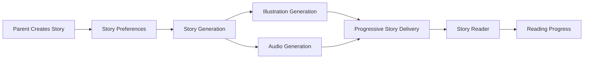
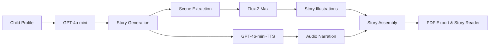

  

<h1 align="center">
GHERAS – AI-Powered Personalized Arabic Children's Storytelling Platform
</h1>

  
  
  
  
  
  

An AI-powered web platform that generates personalized Arabic children's stories with AI-generated illustrations and expressive narration to promote positive behaviors through culturally adaptive storytelling.

  

## Overview
GHERAS is a full-stack AI-powered web platform that generates personalized Arabic children's stories designed to reinforce positive behaviors through engaging, culturally appropriate storytelling.

The platform combines multiple artificial intelligence services including large language models for story generation, text-to-image models for illustration generation, and text-to-speech synthesis for expressive narration, to create a complete multimodal storytelling experience. Each story is personalized using child-specific attributes such as name, age, gender, appearance, interests, target behavior, story genre, and artistic style.

Built with Django REST Framework and React, GHERAS integrates AI services through a modular architecture optimized for asynchronous multimodal content generation and progressive story loading.

## Problem & Motivation

Many existing storytelling applications provide generic stories with limited personalization and insufficient emphasis on culturally relevant behavioral education. GHERAS addresses these challenges by generating personalized Arabic stories that promote positive behaviors through engaging, AI-powered storytelling.

## Key Features

- AI-powered story generation
- Personalized storytelling based on the child's profile
- AI-generated illustrations
- Expressive text-to-speech narration
- Progressive story loading
- PDF export
- Parent dashboard for story history and reading progress

## Interface Screenshots

| Home Page | Children Page |
|:------:|:--------:|
|  |  |

| Create Story Page | Generation Progress|
|:------------:|:-------:|
|  |  |

| Story Reader Page | Library Page |
|:------------:|:--------------------:|
|  |  |

|Progress & Analytics Page|
|:------------:|
|  | 

## System Workflow

## System Architecture

The platform follows a modular client-server architecture that integrates a React frontend, Django REST Framework backend, PostgreSQL database, and AI services for text generation, image generation, and speech synthesis.

The following diagram illustrates the overall system architecture:

## AI Generation Pipeline

GHERAS integrates multiple AI models to generate multimodal stories. GPT-4o mini generates the story text, Flux.2 Max produces context-aware illustrations, and GPT-4o-mini-TTS synthesizes expressive narration. The generated assets are progressively delivered to the user while remaining content is generated asynchronously in the background.

## AI Model Evaluation & Selection
| Task             | Evaluated Models                                     | Selected Model      |
| ---------------- | ---------------------------------------------------- | ------------------- |
| Story Generation | GPT-4o mini, Jais, LFM2.5, Qwen                      | **GPT-4o mini**     |
| Image Generation | Flux.2 Max, GPT Image, Flux.1 Schnell, Z-Image Turbo | **Flux.2 Max**      |
| Speech Synthesis | Multiple TTS Models                                  | **GPT-4o-mini-TTS** |

## Technology Stack

| Layer | Technologies |
|------|--------------|
| Frontend | React, TypeScript, Tailwind CSS |
| Backend | Django, Django REST Framework |
| Database | PostgreSQL |
| AI Services | GPT-4o mini, Flux.2 Max, GPT-4o-mini-TTS |
| Export | PDF generation |
| Testing | Unit testing, API testing, TypeScript checking |

## Future Improvements

- Fine-tune AI models specialized in Arabic educational storytelling.
- Introduce adaptive learning paths based on children's reading progress.
- Expand the parent dashboard with advanced reading analytics, behavioral insights, and personalized story recommendations.
- Integrate a dedicated AI safety guard layer to validate generated stories and enhance content reliability.
- Allow parents to review, edit, and approve AI-generated stories before they are shared with their children.
- Add interactive story elements and voice-based conversations.

## Author

**Amjad**  & others
Bachelor's in Artificial Intelligence  
Umm Al-Qura University

## 🔒 License and Usage
©️ Copyright (c) 2026 GHERAS Project Team.
All Rights Reserved.

This repository is private and shared for portfolio review and recruitment evaluation purposes only.  

No part of this project, including but not limited to source code, documentation, reports, designs, images, videos, diagrams, or generated assets, may be copied, modified, distributed, reused, published, sublicensed, or used for academic, commercial, or personal purposes without prior written permission from the author.

